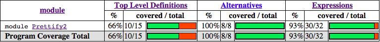

第 11 章：测试和质量保障
================================

构建真实系统意味着我们要关心系统的质量控制，健壮性和正确性。有了正确的质量保障机制，良好编写的代码才能像一架精确的机器一样，所有模块都完成它们预期的任务，并且不会有模棱两可的边界情况。
最后我们得到的将是不言自明，正确无疑的代码——这样的代码往往能激发自信。

Haskell 有几个工具用来构建这样精确的系统。最明显的一个，也是语言本身就内置的，是具有强大表达力的类型系统。
它使得一些复杂的不变量（invariants）得到了静态保证——绝无可能写出违反这些约束条件的代码。另外，纯度和多态也促进了模块化，易重构，易测试的代码风格。
这种类型的代码通常不会出错。

测试在保证代码的正确性上起到了关键作用。Haskell 主要的测试机制是传统的单元测试（通过 HUnit 库）和由它衍生而来的更强机制：
使用 Haskell 开源测试框架 QuickCheck 进行的基于类型的“性质”测试。
基于性质的测试是一种层次较高的方法，它抽象出一些函数应该普遍满足的不变量，真正的测试数据由测试库为程序员产生。
通过这种方法，我们可以用成百上千的测试来检验代码，从而发现一些用其他方法无法发现的微妙的边角情形(corner cases)，而这对于手写来说是不可能的。

在这章里，我们将会学习如何使用 QuickCheck 来建立不变量，然后重新审视之前章节开发的美观打印器，并用 QuickCheck 对它进行测试。
我们也会学习如何用 GHC 的内置代码覆盖工具 HPC 来指导测试过程。

.. _quickchecktype-based-testing:

QuickCheck: 基于类型的测试
------------------------------

为了大概了解基于性质的测试是如何工作的，我们从一个简单的情形开始：你写了一个排序算法，需要测试它的行为。

首先我们载入 QuickCheck 库和其它依赖模块：

::

    -- file: ch11/QC-basics.hs
    import Test.QuickCheck
    import Data.List

然后是我们想要测试的函数——一个自定义的排序过程:

::

    -- file: ch11/QC-basics.hs
    qsort :: Ord a => [a] -> [a]
    qsort []     = []
    qsort (x:xs) = qsort lhs ++ [x] ++ qsort rhs
        where lhs = filter  (< x) xs
              rhs = filter (>= x) xs

这是一个经典的 Haskell 排序实现：它可能不够高效（因为不是原地排序），但它至少展示了函数式编程的优雅。
现在，我们来检查这个函数是否符合一个好排序算法应该符合的基本规则。很多纯函数式代码都有的一个很有用的不变量是\ *幂等*\ （idempotency）——
应用一个函数两次和一次效果应该相同。对于我们的排序过程，一个稳定的排序算法，这当然应该满足，否则就真的出大错了！
这个不变量可以简单地表示为如下性质：

::

    -- file: ch11/QC-basics.hs
    prop_idempotent xs = qsort (qsort xs) == qsort xs

依照 QuickCheck 的惯例，我们给测试性质加上 ``prop_`` 前缀以和普通代码区分。幂等性质可以简单地用一个 Haskell 函数表示：
对于任何已排序输入，再次应用 ``qsort`` 结果必须相同。我们可以手动写几个例子来确保没什么问题：

[译注，运行之前需要确保自己安装了 QuickCheck 包，译者使用的版本是2.8.1。]

::

    ghci> prop_idempotent []
    True
    ghci> prop_idempotent [1,1,1,1]
    True
    ghci> prop_idempotent [1..100]
    True
    ghci> prop_idempotent [1,5,2,1,2,0,9]
    True

看起来不错。但是，用手写输入数据非常无趣，并且违反了一个高效函数式程序员的道德法则：让机器干活！
为了使这个过程自动化，QuickCheck 内置了一组数据生成器用来生成 Haskell 所有的基本数据类型。
QuickCheck 使用 ``Arbitrary`` 类型类来给（伪）随机数据生成过程提供了一个统一接口，类型系统会具体决定使用哪个生成器。
QuickCheck 通常会把数据生成过程隐藏起来，但我们可以手动运行生成器来看看 QuickCheck 生成的数据呈什么分布。
例如，随机生成一组布尔值：

[译注：本例子根据最新版本的 QuickCheck 库做了改动。]

::

    Prelude Test.QuickCheck.Gen Test.QuickCheck.Arbitrary> sample' arbitrary :: IO [Bool]
    [False,False,False,True,False,False,True,True,True,True,True]

QuickCheck 用这种方法产生测试数据，然后通过 ``quickCheck`` 函数把数据传给我们要测试的性质。性质本身的类型决定了它使用哪个数据生成器。
``quickCheck`` 确保对于所有产生的测试数据，性质仍然成立。由于幂等测试对于列表元素类型是多态的，我们需要选择一个特定的类型来产生测试数据，
我们把它作为一个类型约束写在性质上。运行测试的时候，只需调用 ``quickCheck`` 函数，并指定我们性质函数的类型即可（否则的话，列表值将会是没什么意思的 ``()`` 类型）：

::

    *Main Test.QuickCheck> :type quickCheck
    quickCheck :: Testable prop => prop -> IO ()
    *Main Test.QuickCheck> quickCheck (prop_idempotent :: [Integer] -> Bool)
    +++ OK, passed 100 tests.

对于产生的100个不同列表，我们的性质都成立——太棒了！编写测试的时候，查看为每个测试生成的实际数据常常会很有用。
我们可以把 ``quickCheck`` 替换为它的兄弟函数 ``verboseCheck`` 来查看每个测试的（完整）输出。
现在，来看看我们的函数还可能满足什么更复杂的性质。

.. _testing-for-properties:

性质测试
^^^^^^^^^^^^^^^^^^^^^^^^^^^^^^

好的库通常都会包含一组彼此正交而又关联的基本函数。我们可以使用 QuickCheck 来指定我们代码中函数之间的关系，
从而通过一组通过有用性质相互关联的函数来提供一个好的库接口。从这个角度来说，QuickCheck 扮演了 API "lint" 工具的角色：
它确保我们的库 API 能说的通。

列表排序函数的一些有趣性质把它和其它列表操作关联起来。例如：已排序列表的第一个元素应该是输入列表的最小元素。
我们可以使用 ``List`` 库的 ``minimum`` 函数来指出这个性质：

::

    -- file: ch11/QC-basics.hs
    import Data.List
    prop_minimum xs         = head (qsort xs) == minimum xs

测试的时候出错了：

::

    *Main Test.QuickCheck> quickCheck (prop_minimum :: [Integer] -> Bool)
    *** Failed! Exception: 'Prelude.head: empty list' (after 1 test):
    []

当对一个空列表排序时性质不满足了：对于空列表而言，``head`` 和 ``minimum`` 没有定义，正如它们的定义所示：

::

    -- file: ch11/minimum.hs
    head       :: [a] -> a
    head (x:_) = x
    head []    = error "Prelude.head: empty list"

    minimum    :: (Ord a) => [a] -> a
    minimum [] =  error "Prelude.minimum: empty list"
    minimum xs =  foldl1 min xs

因此这个性质只在非空列表上满足。幸运的是，QuickCheck 内置了一套完整的性质编写语言，使我们可以更精确地表述我们的不变量，排除那些我们不予考虑的值。
对于空列表这个例子，我们可以这么说：\ *如果*\ 列表非空，\ *那么*\ 被排序列表的第一个元素是最小值。
这是通过 ``(==>)`` 函数来实现的，它在测试性质之前将无效数据排除在外：

::

    -- file: ch11/QC-basics.hs
    prop_minimum' xs         = not (null xs) ==> head (qsort xs) == minimum xs

结果非常清楚。通过把空列表排除在外，我们可以确定指定性质是成立的。

::

    *Main Test.QuickCheck> quickCheck (prop_minimum' :: [Integer] -> Property)
    +++ OK, passed 100 tests.

注意到我们把性质的类型从 ``Bool`` 改成了更一般的 ``Property`` 类型（property 函数会在测试之前过滤出非空列表，而不仅是简单地返回一个布尔常量了）。

再加上其它一些应该满足的不变量，我们就可以完成排序函数的基本性质集了：输出应该有序（每个元素应该小于等于它的后继元素）；输出是输入的排列（我们通过列表差异函数 ``(\\)`` 来检测）；
被排序列表的最后一个元素应该是最大值；对于两个不同列表的最小值，如果我们把两个列表拼接并排序，这个值应该是第一个元素。
这些性质可以表述如下：

::

    -- file: ch11/QC-basics.hs
    prop_ordered xs = ordered (qsort xs)
        where ordered []       = True
              ordered [x]      = True
              ordered (x:y:xs) = x <= y && ordered (y:xs)

    prop_permutation xs = permutation xs (qsort xs)
        where permutation xs ys = null (xs \\ ys) && null (ys \\ xs)

    prop_maximum xs         =
        not (null xs) ==>
            last (qsort xs) == maximum xs

    prop_append xs ys       =
        not (null xs) ==>
        not (null ys) ==>
            head (qsort (xs ++ ys)) == min (minimum xs) (minimum ys)

.. _testing-against-a-model:

利用模型进行测试
^^^^^^^^^^^^^^^^^^^^^^^^^^^^^^^^^

另一种增加代码可信度的技术是利用模型实现进行测试。我们可以把我们的列表排序函数跟标准列表库中的排序实现进行对比。
如果它们行为相同，我们会有更多信心我们的代码的正确的。

::

    -- file: ch11/QC-basics.hs
    prop_sort_model xs      = sort xs == qsort xs

这种基于模型的测试非常强大。开发人员经常会有一些正确但低效的参考实现或原型。
他们可以保留这部分代码来确保优化之后的生产代码仍具有相同行为。通过构建大量这样的测试并定期运行（例如每次提交），
我们可以很容易地确保代码仍然正确。大型的 Haskell 项目通常包含了跟项目本身大小可比的性质测试集，
每次代码改变都会进行成千上万项不变量测试，保证了代码行为跟预期一致。

.. _testing-case-study-specifying-a-pretty-printer:

测试案例学习：美观打印器
-----------------------------------------------

测试单个函数的自然性质是开发大型 Haskell 系统的基石。我们现在来看一个更复杂的案例：为第五章开发的美观打印器编写测试集。

.. _generating-test-data:

生成测试数据
^^^^^^^^^^^^^^^^^^^^^^^^^^^^^^^^^^^^^^^^^^^^^^^

美观打印器是围绕 ``Doc`` 而建的，它是一个代数数据类型，表示格式良好的文档。

::

    -- file: ch11/Prettify2.hs

    data Doc = Empty
             | Char Char
             | Text String
             | Line
             | Concat Doc Doc
             | Union Doc Doc
             deriving (Show,Eq)

这个库本身是由一组函数构成的，这些函数负责构建和变换 ``Doc`` 类型的值，最后再把它们转换成字符串。

QuickCheck 鼓励这样一种测试方式：开发人员指定一些不变量，它们对于任何代码接受的输入都成立。
为了测试美观打印库，我们首先需要一个输入数据源。我们可以利用 QuickCheck 通过 ``Arbitrary`` 类型类提供的一套用来生成随机数据的组合子集。
``Arbitrary`` 类型类提供了 ``arbitrary`` 函数来给每种类型生成数据，我们可以利用它来给自定义数据类型写数据生成器。

::

    -- file: ch11/Arbitrary.hs
    import Test.QuickCheck.Arbitrary
    import Test.QuickCheck.Gen
    class Arbitrary a where
        arbitrary   :: Gen a

有一点需要注意，函数的类型签名表明生成器运行在 ``Gen`` 环境中。它是一个简单的状态传递 monad，用来隐藏贯穿于代码中的随机数字生成器的状态。
稍后的章节会更加细致地研究 monads，现在只要知道，由于 ``Gen`` 被定义为一个 monad，我们可以使用 ``do`` 语法来定义新生成器来访问隐式的随机数字源。
``Arbitrary`` 类型类提供了一组可以生成随机值的函数，我们可以把它们组合起来构建出我们所关心的类型的数据结构，以便给我们的自定义类型写生成器。
一些关键函数的类型如下：

::

    -- file: ch11/Arbitrary.hs
        elements :: [a] -> Gen a
        choose   :: Random a => (a, a) -> Gen a
        oneof    :: [Gen a] -> Gen a

``elements`` 函数接受一个列表，返回这个列表的随机值生成器。我们稍后再用 ``choose`` 和 ``oneof``。
有了 ``elements``，我们就可以开始给一些简单的数据类型写生成器了。例如，如果我们给三元逻辑定义了一个新数据类型：

::

    -- file: ch11/Arbitrary.hs
    data Ternary
        = Yes
        | No
        | Unknown
        deriving (Eq,Show)

我们可以给 ``Ternary`` 类型实现 ``Arbitrary`` 实例：只要实现 ``arbitrary`` 即可，它从所有可能的 ``Ternary`` 类型值中随机选出一些来：

::

    -- file: ch11/Arbitrary.hs
    instance Arbitrary Ternary where
        arbitrary     = elements [Yes, No, Unknown]

另一种生成数据的方案是生成 Haskell 基本类型数据，然后把它们映射成我们感兴趣的类型。
在写 ``Ternary`` 实例的时候，我们可以用 ``choose`` 生成0到2的整数值，然后把它们映射为 ``Ternary`` 值。

::

    -- file: ch11/Arbitrary2.hs
    instance Arbitrary Ternary where
        arbitrary     = do
            n <- choose (0, 2) :: Gen Int
            return $ case n of
                          0 -> Yes
                          1 -> No
                          _ -> Unknown

对于简单的\ *和*\ 类型，这种方法非常奏效，因为整数可以很好地映射到数据类型的构造器上。
对于\ *积*\ 类型(如结构体和元组)，我们首先得把积的不同部分分别生成（对于嵌套类型递归地生成），然后再把他们组合起来。
例如，生成随机序对：

::

    -- file: ch11/Arbitrary.hs
    instance (Arbitrary a, Arbitrary b) => Arbitrary (a, b) where
        arbitrary = do
            x <- arbitrary
            y <- arbitrary
            return (x, y)

现在我们写个生成器来生成 ``Doc`` 类型所有不同的变种。我们把问题分解，首先先随机生成一个构造器，然后根据结果再随机生成参数。
最复杂的是 union 和 concatenation 这两种情形。

[译注，作者在此处解释并实现了 ``Char`` 的 ``Arbitrary`` 实例。但由于最新 ``QuickCheck`` 已经包含此实例，故此处略去相关内容。]

现在我们可以开始给 ``Doc`` 写实例了。只要枚举构造器，再把参数填进去即可。
我们用一个随机整数来表示生成哪种形式的 ``Doc``，然后再根据结果分派。生成 concat 和 union 的 ``Doc`` 值时，
我们只需要递归调用 ``arbitrary`` 即可，类型推导会决定使用哪个 ``Arbitrary`` 实例：

::

    -- file: ch11/QC.hs
    instance Arbitrary Doc where
        arbitrary = do
            n <- choose (1,6) :: Gen Int
            case n of
                 1 -> return Empty

                 2 -> do x <- arbitrary
                         return (Char x)

                 3 -> do x <- arbitrary
                         return (Text x)

                 4 -> return Line

                 5 -> do x <- arbitrary
                         y <- arbitrary
                         return (Concat x y)

                 6 -> do x <- arbitrary
                         y <- arbitrary
                         return (Union x y)

看起来很直观。我们可以用 ``oneof`` 函数来化简它。我们之前见到过 ``oneof`` 的类型，它从列表中选择一个生成器（我们也可以用 monadic 组合子 ``liftM`` 来避免命名中间结果）：

::

    -- file: ch11/QC.hs
    instance Arbitrary Doc where
        arbitrary =
            oneof [ return Empty
                  , liftM  Char   arbitrary
                  , liftM  Text   arbitrary
                  , return Line
                  , liftM2 Concat arbitrary arbitrary
                  , liftM2 Union  arbitrary arbitrary ]

后者更简洁。我们可以试着生成一些随机文档，确保没什么问题。

::

    *QC Test.QuickCheck> sample' (arbitrary::Gen Doc)
    [Text "",Concat (Char '\157') Line,Char '\NAK',Concat (Text "A\b") Empty,
    Union Empty (Text "4\146~\210"),Line,Union Line Line,
    Concat Empty (Text "|m  \DC4-\DLE*3\DC3\186"),Char '-',
    Union (Union Line (Text "T\141\167\&3\233\163\&5\STX\164\145zI")) (Char '~'),Line]

从输出的结果里，我们既看到了简单，基本的文档，也看到了相对复杂的嵌套文档。每次测试时我们都会随机生成成百上千的随机文档，他们应该可以很好地覆盖各种情形。
现在我们可以开始给我们的文档函数写一些通用性质了。

.. _testing-document-construction:

测试文档构建
^^^^^^^^^^^^^^^^^^^^^^^^^^^^^^^^^^^^^^^^^^^^^^^

文档有两个基本函数：一个是空文档常量 ``Empty``，另一个是拼接函数。它们的类型是：

::

    -- file: ch11/Prettify2.hs
    empty :: Doc
    (<>)  :: Doc -> Doc -> Doc

两个函数合起来有一个不错的性质：将空列表拼接在（无论是左拼接还是右拼接）另一个列表上，这个列表保持不变。
我们可以将这个不变量表述为如下性质：

::

    -- file: ch11/QC.hs
    prop_empty_id x =
        empty <> x == x
      &&
        x <> empty == x

运行测试，确保性质成立：

::

    *QC Test.QuickCheck> quickCheck prop_empty_id
    +++ OK, passed 100 tests.

可以把 ``quickCheck`` 替换成 ``verboseCheck`` 来看看实际测试时用的是哪些文档。
从输出可以看到，简单和复杂的情形都覆盖到了。如果需要的话，我们还可以进一步优化数据生成器来控制不同类型数据的比例。

其它 API 函数也很简单，可以用性质来完全描述它们的行为。
这样做使得我们可以对函数的行为维护一个外部的，可检查的描述以确保之后的修改不会破坏这些基本不变量：

::

    -- file: ch11/QC.hs

    prop_char c   = char c   == Char c

    prop_text s   = text s   == if null s then Empty else Text s

    prop_line     = line     == Line

    prop_double d = double d == text (show d)

这些性质足以测试基本的文档结构了。测试库的剩余部分还要更多工作。

.. _using-lists-as-a-model:

以列表为模型
^^^^^^^^^^^^^^^^^^^^^^^^^^^^^^^^^^^^^^^^^^^^^^^

高阶函数是可复用编程的基本胶水，我们的美观打印库也不例外——我们自定义了 fold 函数，用来在内部实现文档拼接和在文档块之间加分隔符。
``fold`` 函数接受一个文档列表，并借助一个合并方程（combining function）把它们粘合在一起。

::

    -- file: ch11/Prettify2.hs
    fold :: (Doc -> Doc -> Doc) -> [Doc] -> Doc
    fold f = foldr f empty

我们可以很容易地给某个特定 fold 实例写测试。例如，横向拼接（Horizontal concatenation）就可以简单地利用列表中的参考实现来测试。

::

    -- file: ch11/QC.hs

    prop_hcat xs = hcat xs == glue xs
        where
            glue []     = empty
            glue (d:ds) = d <> glue ds

``punctuate`` 也类似，插入标点类似于列表的 interspersion 操作（``intersperse`` 这个函数来自于 ``Data.List``，它把一个元素插在列表元素之间）：

::

    -- file: ch11/QC.hs

    prop_punctuate s xs = punctuate s xs == intersperse s xs

看起来不错，运行起来却出了问题：

::

    *QC Test.QuickCheck> quickCheck prop_punctuate
    *** Failed! Falsifiable (after 5 tests and 1 shrink):
    Empty
    [Text "",Text "E"]

美观打印库优化了冗余的空文档，然而模型实现却没有，所以我们得让模型匹配实际情况。
首先，我们可以把分隔符插入文档，然后再用一个循环去掉当中的 ``Empty`` 文档，就像这样：

::

    -- file: ch11/QC.hs
    prop_punctuate' s xs = punctuate s xs == combine (intersperse s xs)
        where
            combine []           = []
            combine [x]          = [x]

            combine (x:Empty:ys) = x : combine ys
            combine (Empty:y:ys) = y : combine ys
            combine (x:y:ys)     = x `Concat` y : combine ys

在 **ghci** 里运行，确保结果是正确的。测试框架发现代码中的错误让人感到欣慰——因为这正是我们追求的。

::

    *QC Test.QuickCheck> quickCheck prop_punctuate'
    +++ OK, passed 100 tests.

.. _putting-it-altogether:

完成测试框架
^^^^^^^^^^^^^^^^^^^^^^^^^^^^^^^^^^^^^^^^^^^^^^^

[译注：为了匹配最新版本的 QuickCheck，本节在原文基础上做了较大改动。读者可自行参考原文，对比阅读。]

我们可以把这些测试单独放在一个文件中，然后用 QuickCheck 的驱动函数运行它们。
这样的函数有很多，包括一些复杂的并行驱动函数。我们在这里使用 ``quickCheckWithResult`` 函数。
我们只需提供一些测试参数，然后列出我们想要测试的函数即可：

::

    -- file: ch11/Run.hs
    module Main where
    import QC
    import Test.QuickCheck

    anal :: Args
    anal = Args
        { replay = Nothing
        , maxSuccess = 1000
        , maxDiscardRatio = 1
        , maxSize = 1000
        , chatty = True
        }

    minimal :: Args
    minimal = Args
        { replay = Nothing
        , maxSuccess = 200
        , maxDiscardRatio = 1
        , maxSize = 200
        , chatty = True
        }

    runTests :: Args -> IO ()
    runTests args = do
        f prop_empty_id "empty_id ok?"
        f prop_char "char ok?"
        f prop_text "text ok?"
        f prop_line "line ok?"
        f prop_double "double ok?"
        f prop_hcat "hcat ok?"
        f prop_punctuate' "punctuate ok?"
        where
            f prop str = do
                putStrLn str
                quickCheckWithResult args prop
                return ()

    main :: IO ()
    main = do
        putStrLn "Choose test depth"
        putStrLn "1. Anal"
        putStrLn "2. Minimal"
        depth <- readLn
        if depth == 1
            then runTests anal
        else runTests minimal

[译注：此代码出处为原文下Charlie Harvey的评论。]

我们把这些代码放在一个单独的脚本中，声明的实例和性质也有自己单独的文件，它们库的源文件完全分开。
这在库项目中非常常见，通常在这些项目中测试都会和库本身分开，测试通过模块系统载入库。

这时候可以编译并运行测试脚本了：

::

    $ ghc --make Run.hs
    [1 of 3] Compiling Prettify2        ( Prettify2.hs, Prettify2.o )
    [2 of 3] Compiling QC               ( QC.hs, QC.o )
    [3 of 3] Compiling Main             ( Run.hs, Run.o )
    Linking Run ...
    $ ./Run
    Choose test depth
    1. Anal
    2. Minimal
    2
    empty_id ok?
    +++ OK, passed 200 tests.
    char ok?
    +++ OK, passed 200 tests.
    text ok?
    +++ OK, passed 200 tests.
    line ok?
    +++ OK, passed 1 tests.
    double ok?
    +++ OK, passed 200 tests.
    hcat ok?
    +++ OK, passed 200 tests.
    punctuate ok?
    +++ OK, passed 200 tests.

一共产生了1201个测试，很不错。增加测试深度很容易，但为了了解代码究竟被测试的怎样，我们应该使用内置的代码覆盖率工具 HPC，它可以精确地告诉我们发生了什么。

.. _measuring-test-coverage-with-hpc:

用 HPC 衡量测试覆盖率
-----------------------------------------------

HPC(Haskell Program Coverage) 是一个编译器扩展，用来观察程序运行时哪一部分的代码被真正执行了。
这在测试时非常有用，它让我们精确地观察哪些函数，分支以及表达式被求值了。
我们可以轻易得到被测试代码的百分比。HPC 的内置工具可以产生关于程序覆盖率的图表，方便我们找到测试集的缺陷。

在编译测试代码时，我们只需在命令行加上 ``-fhpc`` 选项，即可得到测试覆盖率数据。

::

    $ ghc -fhpc Run.hs --make

正常运行测试：

::

    $ ./Run

测试运行时，程序运行的细节被写入当前目录下的 .tix 和 .mix 文件。
之后，命令行工具 ``hpc`` 用这些文件来展示各种统计数据，解释发生了什么。最基本的交互是通过文字。
首先，我们可以在 ``hpc`` 命令中加上 ``report`` 选项来得到一个测试覆盖率的摘要。
我们会把测试程序排除在外（使用 ``--exclude`` 选项），这样就能把注意力集中在美观打印库上了。
在命令行中输入以下命令：

::

    $ hpc report Run --exclude=Main --exclude=QC
     93% expressions used (30/32)
    100% boolean coverage (0/0)
        100% guards (0/0)
        100% 'if' conditions (0/0)
        100% qualifiers (0/0)
    100% alternatives used (8/8)
    100% local declarations used (0/0)
     66% top-level declarations used (10/15)

[译注：报告结果可能因人而异。]

在最后一行我们看到，测试时有66%的顶层定义被求值。对于第一次尝试来说，已经是很不错的结果了。
随着被测试函数的增加，这个数字还会提升。对于快速了解结果来说文字版本的结果还不错，但为了真正了解发生了什么，
最好还是看看被标记后的结果（marked up output）。用 ``markup`` 选项可以生成：

::

    $hpc markup Run --exclude=Main --exclude=QC

它会对每一个 Haskell 源文件产生一个 html 文件，再加上一些索引文件。在浏览器中打开 ``hpc_index.html``，
我们可以看到一些非常漂亮的代码覆盖率图表：

还不错。打开 ``Prettify2.hs.html`` 可以看到程序的源代码，其中未被测试的代码用黄色粗体标记，被执行的代码用粗体标记。

.. image:: ../image/ch11/markup.png

我们没测 ``Monoid`` 实例，还有一些复杂函数也没测。HPC 不会说谎。我们来给 ``Monoid`` 类型类实例加个测试，
这个类型类支持拼接元素和返回空元素：

::

    -- file: ch11/QC.hs
    prop_mempty_id x =
        mempty `mappend` x == x
      &&
        x `mappend` mempty == (x :: Doc)

在 **ghci** 里检查确保正确：

::

    *QC Test.QuickCheck> quickCheck prop_mempty_id
    +++ OK, passed 100 tests.

我们现在可以重新编译并运行测试了。确保旧的 .tix 被删除，否则当 HPC 试图合并两次测试数据时会报错：

::

    $ ghc -fhpc Run.hs --make -fforce-recomp
    [1 of 3] Compiling Prettify2        ( Prettify2.hs, Prettify2.o )
    [2 of 3] Compiling QC               ( QC.hs, QC.o )
    [3 of 3] Compiling Main             ( Run.hs, Run.o )
    Linking Run ...
    $ ./Run
    in module 'Main'
    Hpc failure: module mismatch with .tix/.mix file hash number
    (perhaps remove Run.tix file?)
    $rm Run.tix
    $./Run
    Choose test depth
    1. Anal
    2. Minimal
    2
    empty_id ok?
    +++ OK, passed 200 tests.
    char ok?
    +++ OK, passed 200 tests.
    text ok?
    +++ OK, passed 200 tests.
    line ok?
    +++ OK, passed 1 tests.
    double ok?
    +++ OK, passed 200 tests.
    hcat ok?
    +++ OK, passed 200 tests.
    punctuate ok?
    +++ OK, passed 200 tests.
    prop_mempty_id ok?
    +++ OK, passed 200 tests.

测试用例又多了两百个，我们的代码覆盖率也提高到了80%：

.. image:: ../image/ch11/hpc-round2.png

HPC 确保我们在测试时诚实，因为任何没有被覆盖到的代码都会被标记出来。
特别地，它确保程序员考虑到各种错误情形，状况不明朗的复杂分支，以及各式各样的代码。
有了 QuickCheck 这样全面的测试生成系统，测试变得非常有意义，也成了 Haskell 开发的核心。
