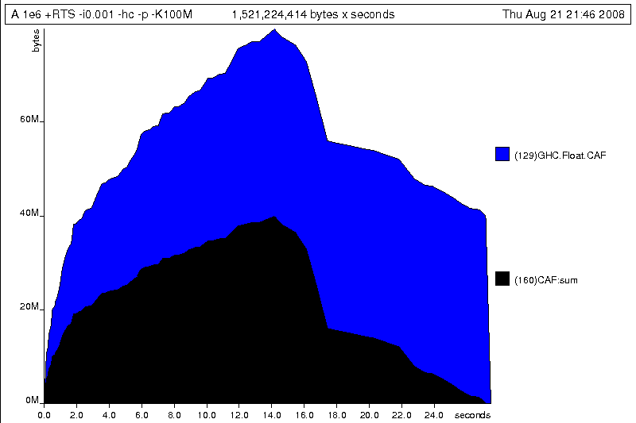
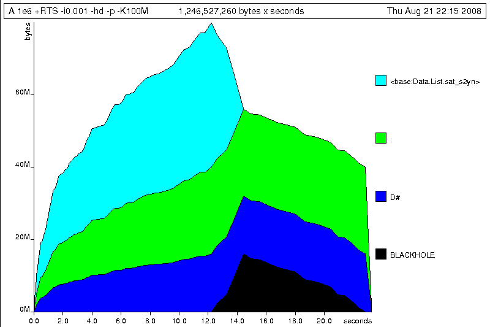
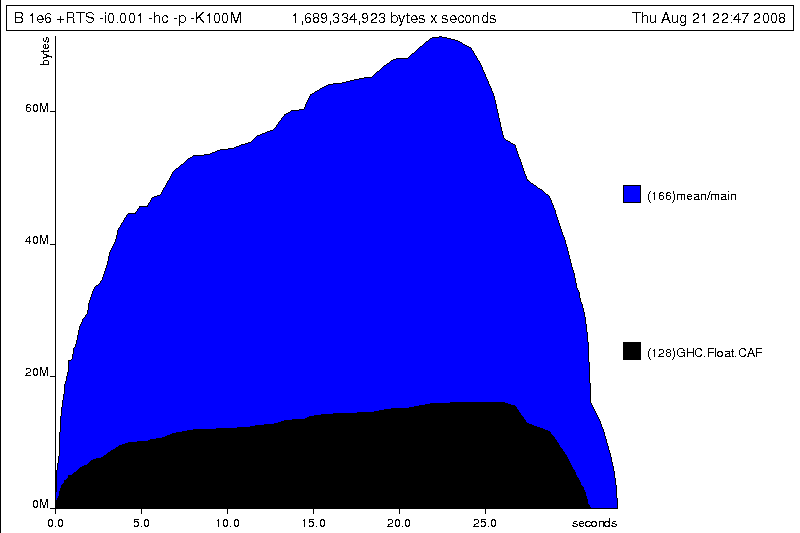

第 25 章：性能分析与优化
==============================

..
    Haskell is a high level language. A really high level language.
    We can spend our days programming entirely in abstractions, in monoids,
    functors and hylomorphisms, far removed from any particular hardware model
    of computation.
    The language specification goes to great lengths to avoid prescribing
    any particular evaluation model.
    These layers of abstraction let us treat Haskell as a notation for computation itself,
    letting the programmer concentrate on the essence of their problem without
    getting bogged down in low level implementation decisions.
    We get to program in pure thought.

Haskell 是一门高级编程语言，一门真正的高级编程语言。 我们可以完全使用抽象概念、
幺半群、函子、以及多态进行每日的编程，而不必与任何特定的硬件模型打交道。
Haskell 在语言规范方面下了很大的功夫，力求语言可以不受制于某个特定的求值模型。
这几层抽象使得我们可以把 Haskell 作为计算本身的记号，
让编程人员关心他们问题的关键点，而不用操心低层次的实现细节，
使得人们可以心无旁骛地进行编程。

..
    However, this is a book about real world programming, and in the real world,
    code runs on stock hardware with limited resources.
    Our programs will have time and space requirements that we may need to enforce.
    As such, we need a good knowledge of how our program data is represented,
    the precise consequences of using lazy or strict evaluation strategies,
    and techniques for analyzing and controlling space and time behavior.

但是，本书介绍的是真实世界中的编程行为，而真实世界中的代码都运行在资源有限的硬件之上，
并且程序也会有时间和空间上的限制。
因此，我们需要掌握程序数据的表示方式，准确地理解使用惰性求值和严格求值策略带来的后果，
并学会如何分析和控制程序在时间和空间上的行为。

..
    In this chapter we'll look at typical space and time problems a Haskell programmer
    might encounter, and how to methodically analyse, understand and address them.
    To do this we'll use investigate a range of techniques: time and space profiling,
    runtime statistics, and reasoning about strict and lazy evaluation.
    We'll also look at the impact of compiler optimizations on performance,
    and the use of advanced optimization techniques that become feasible
    in a purely functional language. So let's begin with a challenge:
    squashing unexpected memory usage in some inoccuous looking code.

在这一章，我们将看到 Haskell 编程中可能遇到的典型空间和时间问题，
并且如何有条理地分析、理解并解决它们。
为此我们将研究使用一系列的技术：时间和空间使用分析，运行时统计，以及对严格求值和惰性求值进行推断。
我们也会看下编译器优化对性能的影响，以及在纯函数式编程语言中可行的高级优化技术的应用。
那么，让我们用一个挑战开始吧：调查一个看似无害的程序中出乎意料的内存使用的问题。

Haskell程序性能分析
-------------------

..
    Let's consider the following list manipulating program,
    which naively computes the mean of some large list of values.
    While only a program fragment (and we'll stress that the particular algorithm
    we're implementing is irrelevant here),
    it is representative of real code we might find in any Haskell program:
    typically concise list manipulation code,
    and heavy use of standard library functions.
    It also illustrates several common performance trouble spots that can catch out the unwary.

请看下面这个列表处理程序，它用于计算某个超长列表的平均值。
这里展示的只是程序的其中一部分代码（并且具体的实现算法我们并不关心），
这是我们经常会在真实的 Haskell 程序中看到的典型的简单列表操作代码，
这些代码大量地使用标准库函数，并且包含了一些因为疏忽大意而导致的性能问题。
这里也展示了几种因疏忽而易出现的性能问题。

::

    -- file: ch25/A.hs
    import System.Environment
    import Text.Printf

    main = do
        [d] <- map read `fmap` getArgs
        printf "%f\n" (mean [1..d])

    mean :: [Double] -> Double
    mean xs = sum xs / fromIntegral (length xs)

..
    This program is very simple: we import functions for accessing
    the system's environment (in particular, getArgs),
    and the Haskell version of printf, for formatted text output.
    The program then reads a numeric literal from the command line,
    using that to build a list of floating point values,
    whose mean value we compute by dividing the list sum by its length.
    The result is printed as a string.
    Let's compile this source to native code (with optimizations on)
    and run it with the time command to see how it performs:

这个程序非常简单：我们引用了访问系统环境的函数（即 ``getArgs`` ），
和 Haskell 版的 ``printf`` 函数来格式化输出。接着这个程序从命令行
读入一个数字来构建一个由浮点数组成的列表。我们用这个列表的和除以列表的
长度得到平均值，然后以字符串的形式打印出来。我们来将此代码编译成机器代码（打开优化开关）
然后用 ``time`` 命令执行它看看情况吧：

::

    $ ghc --make -rtsopts -O2 A.hs
    [1 of 1] Compiling Main             ( A.hs, A.o )
    Linking A ...
    $ time ./A 1e5
    50000.5
    ./A 1e5  0.05s user 0.01s system 102% cpu 0.059 total
    $ time ./A 1e6
    500000.5
    ./A 1e6  0.26s user 0.04s system 99% cpu 0.298 total
    $ time ./A 1e7
    5000000.5
    ./A 1e7  63.80s user 0.62s system 99% cpu 1:04.53 total

..
    It worked well for small numbers,
    but the program really started to struggle with input size of ten million.
    From this alone we know something's not quite right,
    but it's unclear what resources are being used. Let's investigate.

程序在处理少量元素时运行得非常好，但是当输入的列表元素数量达到一千万个时，
程序的运行速度就会变得相当缓慢。从这点我们就能感觉到应该有什么地方做得不对，
但我们并不清楚它的资源使用情况。 我们需要研究下。

..
    Collecting runtime statistics
    +++++++++++++++++++++++++++++

收集运行时统计
++++++++++++++

..
    To get access to that kind of information,
    GHC lets us pass flags directly to the Haskell runtime, using the special
    +RTS and -RTS flags to delimit arguments reserved for the runtime system.
    The application itself won't see those flags, as they're immediately
    consumed by the Haskell runtime system.

为了能收集这些情报，GHC 支持传入 ``+RTS`` 和 ``-RTS`` 这些划定给运行时系统的特殊选项。
应用程序并不会接收到这些选项，因为它们会立即被 Haskell 运行时系统消耗到。

..
    In particular, we can ask the runtime system to gather memory and
    garbage collector performance numbers with the -s flag (as well as
    control the number of OS threads with -N, or tweak the stack and heap sizes).
    We'll also use runtime flags to enable different varieties of profiling.
    The complete set of flags the Haskell runtime accepts is documented in the
    GHC User's Guide:

特别地，我们可以用 ``-s`` 选项来让运行时系统收集内存和垃圾收集器(GC)的性能参数
（并可以用 ``-N`` 来控制系统线程的数量，或调整栈和堆的大小）。
我们将用各种运行时选项来启动不同的性能分析。
Haskell 运行时能够接受的所有选项列表可以参见 GHC 用户手册。

..
    So let's run the program with statistic reporting enabled,
    via +RTS -sstderr, yielding this result.

那么让我们用 ``+RTS -sstderr`` 来运行程序取得我们所需要的结果吧。

::

    $ ./A 1e7 +RTS -sstderr
    5000000.5
    1,689,133,824 bytes allocated in the heap
    697,882,192 bytes copied during GC (scavenged)
    465,051,008 bytes copied during GC (not scavenged)
    382,705,664 bytes maximum residency (10 sample(s))

           3222 collections in generation 0 (  0.91s)
             10 collections in generation 1 ( 18.69s)

            742 Mb total memory in use

      INIT  time    0.00s  (  0.00s elapsed)
      MUT   time    0.63s  (  0.71s elapsed)
      GC    time   19.60s  ( 20.73s elapsed)
      EXIT  time    0.00s  (  0.00s elapsed)
      Total time   20.23s  ( 21.44s elapsed)

      %GC time      96.9%  (96.7% elapsed)

      Alloc rate    2,681,318,018 bytes per MUT second

      Productivity   3.1% of total user, 2.9% of total elapsed

..
    When using -sstderr, our program's performance numbers are printed to the standard
    error stream, giving us a lot of information about what our program was doing.
    In particular, it tells us how much time was spent in garbage collection,
    and what the maximum live memory usage was.
    It turns out that to compute the mean of a list of 10 million elements
    our program used a maximum of 742 megabytes on the heap,
    and spent 96.9% of its time doing garbage collection! In total,
    only 3.1% of the program's running time was spent doing productive work.

当使用 ``-sstderr`` 时，程序的性能数字会输出到标准错误流里，告诉我们很多关于程序
在具体做什么的信息。尤其是，它告诉了我们 GC 占用了多少时间，以及最大活动内存的使用情况。
原来，为了计算一千万个元素的平均值，程序在堆上使用了多达 742M 的内存，并且 96.9% 的时间是
花费到垃圾收集器上的！总的来说，只有 3.1% 的时间是程序用来干正事的。

..
    So why is our program behaving so badly, and what can we do to improve it?
    After all, Haskell is a lazy language: shouldn't it be able to process the list
    in constant space?

那么为什么我们的程序运行情况这么差？我们如何来提高它呢？毕竟，Haskell 是一个惰性语言：
它不应该只用恒定的内存空间来处理列表吗？

..
    Time profiling
    ++++++++++++++

时间分析
++++++++

..
    GHC, thankfully, comes with several tools to analyze a program's time and space usage.
    In particular, we can compile a program with profiling enabled, which, when run,
    yields useful information about what resources each function was using.
    Profiling proceeds in three steps: compiling the program for profiling;
    running it with particular profiling modes enabled; and inspecting the resulting statistics.

庆幸的是，GHC 为我们提供了多种工具来分析程序的时间和空间使用情况。
我们可以在编译程序时打开性能调试选项，这样程序在执行时会生成每个函数的资源使用信息。
使用性能调试分为三步：以性能调试方式编译程序；执行程序时打开特定的性能分析模式；最后是分析收集到的统计数据。

..
    To compile our program for basic time and allocation profiling, we use the -prof flag.
    We also need to tell the profiling code which functions we're interested in profiling,
    by adding "cost centres" to them.
    A cost centre is a location in the program we'd like to collect statistics about,
    and GHC will generate code to compute the cost of evaluating the expression at each location.
    Cost centres can be added manually to instrument any expression, using the SCC pragma:

编译程序时，我们可以使用 ``-prof`` 性能调试选项来得到基本的时间和空间消耗信息。
我们也需要给感兴趣的函数标记为“消耗集中点(cost centres)”以便让性能调试程序知晓。
一个消耗集中点即是一个信息收集点，GHC 会生成代码来计算在这些地方执行的表达式的消耗情况。
我们可以用 ``SCC`` 编译指示(pragma)把任何表达式设为消耗集中点。

::

    -- file: ch25/SCC.hs
    mean :: [Double] -> Double
    mean xs = {-# SCC "mean" #-} sum xs / fromIntegral (length xs)

..
    Alternatively, we can have the compiler insert the cost centres on
    all top level functions for us by compiling with the -auto-all flag.
    Manual cost centres are a useful addition to automated cost centre profiling,
    as once a hot spot has been identified, we can precisely pin down the
    expensive sub-expressions of a function.

或者，我们也可以用 ``-auto-all`` 选项来让编译器将所有顶级函数设为消耗集中点。
然后在我们识别出某个性能热点(hot spot)的函数之后，把手动添加消耗集中点作为一个十分有用的补充，
就可以更为精确地去侦测该函数的子表达式了。

..
    One complication to be aware of: in a lazy, pure language like Haskell,
    values with no arguments need only be computed once
    (for example, the large list in our example program),
    and the result shared for later uses.
    Such values are not really part of the call graph of a program,
    as they're not evaluated on each call, but we would of course still like to
    know how expensive their one-off cost of evaluation was.
    To get accurate numbers for these values, known as "constant applicative forms",
    or CAFs, we use the -caf-all flag.

需要注意的一个复杂的地方：在 Haskell 这类惰性、纯函数式编程语言里，
没有参数的值只会被计算一次（比如之前计算超长列表的程序），然后计算的结果会在之后共享。
于是这种函数在调用关系图(call graph)中记录的统计值并不准确，因为它们并不是每次调用都执行。
然而，我们仍然想要知道它们一次执行的消耗情况是怎么样。
为了得到这种被称为“常量函数体(Constant Applicative Forms)”或 CAF 的确切值，
我们可以使用 ``-caf-all`` 选项。

..
    Compiling our example program for profiling then (using the -fforce-recomp flag
    to to force full recompilation):

那么以性能调试的方式来编译我们的程序吧（用 ``-fforce-recomp`` 选项来强制重新编译所有部分）：

::

    $ ghc -O2 --make A.hs -prof -auto-all -caf-all -fforce-recomp
    [1 of 1] Compiling Main             ( A.hs, A.o )
    Linking A ...

..
    We can now run this annotated program with time profiling enabled
    (and we'll use a smaller input size for the time being,
    as the program now has additional profiling overhead):

现在我们可以执行这个标记了性能分析点的程序了 （标记了性能分析的程序会
变慢，所以我们用一个较小的输入来执行）：

::

    $ time ./A  1e6 +RTS -p
    Stack space overflow: current size 8388608 bytes.
    Use `+RTS -Ksize' to increase it.
    ./A 1e6 +RTS -p  1.11s user 0.15s system 95% cpu 1.319 total

..
    The program ran out of stack space! This is the main complication to
    be aware of when using profiling: adding cost centres to a program modifies
    how it is optimized, possibly changing its runtime behavior, as each
    expression now has additional code associated with it to track the
    evaluation steps. In a sense, observing the program executing modifies
    how it executes. In this case, it is simple to proceed
    -- we use the GHC runtime flag, -K, to set a larger stack limit for
    our program (with the usual suffixes to indicate magnitude):

程序竟然把栈空间耗完了！这就是使用性能调试时需要注意的主要影响：
给程序加消耗集中点会改变它的优化方式，进而可能影响它的运行时表现，
因为每一个被标记的表达式都会被附加一段额外的代码，来跟踪它们的执行轨迹。
从某种意义上说，观察程序执行会影响它的执行。
对于我们这样情况，修正起来很简单——只需要通过 GHC 运行时选项 ``-K`` 来增加
栈空间上限即可（要附带指示存储单位的后缀）：

::

    $ time ./A 1e6 +RTS -p -K100M
    500000.5
    ./A 1e6 +RTS -p -K100M  4.27s user 0.20s system 99% cpu 4.489 total

..
    The runtime will dump its profiling information into a file,
    A.prof (named after the binary that was executed)
    which contains the following information:

运行时会将性能信息生成到一个名字为 ``A.prof``（以可执行程序的名字命名）的文件中。
其中含有以下信息：

::

    $ cat A.prof

    Time and Allocation Profiling Report  (Final)

           A +RTS -p -K100M -RTS 1e6

        total time  =        0.28 secs   (14 ticks @ 20 ms)
        total alloc = 224,041,656 bytes  (excludes profiling overheads)

    COST CENTRE  MODULE               %time %alloc

    CAF:sum      Main                  78.6   25.0
    CAF          GHC.Float             21.4   75.0

                                                individual    inherited
    COST CENTRE MODULE         no.    entries  %time %alloc   %time %alloc

    MAIN        MAIN            1           0   0.0    0.0   100.0  100.0
     main       Main          166           2   0.0    0.0     0.0    0.0
      mean      Main          168           1   0.0    0.0     0.0    0.0
     CAF:sum    Main          160           1  78.6   25.0    78.6   25.0
     CAF:lvl    Main          158           1   0.0    0.0     0.0    0.0
      main      Main          167           0   0.0    0.0     0.0    0.0
     CAF        Numeric       136           1   0.0    0.0     0.0    0.0
     CAF        Text.Read.Lex 135           9   0.0    0.0     0.0    0.0
     CAF        GHC.Read      130           1   0.0    0.0     0.0    0.0
     CAF        GHC.Float     129           1  21.4   75.0    21.4   75.0
     CAF        GHC.Handle    110           4   0.0    0.0     0.0    0.0

..
    This gives us a view into the program's runtime behavior.
    We can see the program's name and the flags we ran it with.
    The "total time" is time actually spent executing code from the
    runtime system's point of view, and the total allocation is the number
    of bytes allocated during the entire program run
    (not the maximum live memory, which was around 700MB).

这些信息呈现给我们一些关于程序的运行时行为的情况。里面包含了程序的名字以及
执行程序时用到的选项和参数。“total time”是运行时系统视角所见的程序运行
的确切总时长。“total alloc”是程序在运行过程中分配的内存总字节数（不是
程序运行时内存使用的峰值；那个峰值大概是 700MB）

..
    The second section of the profiling report is the proportion of time and
    space each function was responsible for. The third section is the cost centre report,
    structured as a call graph (for example, we can see that mean was called from main.
    The "individual" and "inherited" columns give us the resources a cost centre
    was responsible for on its own, and what it and its children were responsible for.
    Additionally, we see the one-off costs of evaluating constants
    (such as the floating point values in the large list, and the list itself)
    assigned to top level CAFs.

报告中的第二段是各个函数所消耗的时间和空间部分。
第三段是消耗集中点的报告：调用关系图的格式（比如，我们可以看到 ``mean`` 是被 ``main`` 调用的）。
“individual”和“inherited”列提供了每个消耗集中点其本身、以及它和它的子部分
所消耗的资源。此外，最下面那些 ``CAF`` 是常量执行的一次性消耗（例如超长列表中
浮点数以及列表本身）。

..
    What conclusions can we draw from this information? We can see that the
    majority of time is spent in two CAFs, one related to computing the sum,
    and another for floating point numbers. These alone account for nearly
    all allocations that occurred during the program run. Combined with our
    earlier observation about garbage collector stress, it begins to look like
    the list node allocations, containing floating point values,
    are causing a problem.

我们能从这些信息得出什么结论呢？我们可以看出两个 ``CAF`` 占用了大多数时间：
一个与计算总和相关，另一个与浮点数相关。
单独它们就几乎占据了程序运行期间的所有消耗。
结合我们之前观察到 GC 的压力问题，看起来像是在列表结点的内存分配和浮点数值上发生了问题。

..
    For simple performance hot spot identification, particularly in large
    programs where we might have little idea where time is being spent,
    the initial time profile can highlight a particular problematic module
    and top level function, which is often enough to reveal the trouble spot.
    Once we've narrowed down the code to a problematic section,
    such as our example here, we can use more sophisticated profiling
    tools to extract more information.

简单的性能热点检测，特别是对于我们难以知道时间花费点的大型程序，
这个时间分析会突出某些问题模块或顶级函数。这往往已足够显示出问题所在了。
就像我们的程序，一旦我们缩小了问题代码的范围，我们就可以用更加尖端的分析工具来拿到更多的信息。

..
    Space profiling
    +++++++++++++++

空间分析
++++++++

..
    Beyond basic time and allocation statistics, GHC is able to generate
    graphs of memory usage of the heap, over the program's lifetime.
    This is perfect for revealing "space leaks", where memory is retained
    unnecessarily, leading to the kind of heavy garbage collector activity
    we see in our example.

GHC 除了可以进行基本的时间和空间统计外，还能为程序整个执行期间的堆内存使用
情况生成图表。这能完美检测内存泄露问题。内存泄露是指不再需要的内存没有被释放。
这会对 GC 造成压力，就像在我们的例子程序中见到的那样。

..
    Constructing a heap profile follows the same steps as constructing
    a normal time profile, namely, compile with -prof -auto-all -caf-all,
    but when we execute the program, we'll ask the runtime system to gather
    more detailed heap use statistics. We can break down the heap use
    information in several ways: via cost-centre, via module, by constructor,
    by data type, each with its own insights. Heap profiling A.hs logs
    to a file A.hp, with raw data which is in turn processed by the tool
    hp2ps, which generates a PostScript-based, graphical visualization
    of the heap over time.

构建堆内存分析和构建一般时间分析的步骤是一样，
都需要用到 ``-prof -auto-all -caf-all`` 编译选项。 但当执行程序时，
我们会让运行时系统收集关于堆使用的最多细节。堆使用信息能够以几种方式分解：
消耗集中点、模块、构造器和数据类型。每个都有各自的洞见。
对 ``A.hs`` 进行堆内存分析所得的原始数据会被记录到一个名为 ``A.hp`` 的文件里面，
之后只要使用 ``hp2ps`` 处理这个文件，
就可以得到一个堆内存占用历史图像的 PostScript 文件。

..
    To extract a standard heap profile from our program, we run it with
    the -hc runtime flag:

想要使用标准的堆内存分析的话，可以在运行程序时使用 ``-hc`` 作为运行时的性能分析选项：

::

    $ time ./A 1e6 +RTS -hc -p -K100M
    500000.5
    ./A 1e6 +RTS -hc -p -K100M  4.15s user 0.27s system 99% cpu 4.432 total

..
    A heap profiling log, A.hp, was created, with the content
    in the following form:

一个堆内存分析的日志文件 ``A.hp`` 会创建出来，其内容为以下形式：

::

    JOB "A 1e6 +RTS -hc -p -K100M"
    SAMPLE_UNIT "seconds"
    VALUE_UNIT "bytes"
    BEGIN_SAMPLE 0.00
    END_SAMPLE 0.00
    BEGIN_SAMPLE 0.24
    (167)main/CAF:lvl   48
    (136)Numeric.CAF    112
    (166)main   8384
    (110)GHC.Handle.CAF 8480
    (160)CAF:sum    10562000
    (129)GHC.Float.CAF  10562080
    END_SAMPLE 0.24

..
    Samples are taken at regular intervals during the program run.
    We can increase the heap sampling frequency by using -iN, where N is
    the number of seconds (e.g. 0.01) between heap size samples. Obviously,
    the more we sample, the more accurate the results, but the slower
    our program will run. We can now render the heap profile as a graph,
    using the hp2ps tool:

这些样本是在程序运行期间以固定的间隔采样出来的。
我们可以用 ``-iN`` 选项来增加采样频率，
这里的 ``N`` 是内存采样之间相隔的秒数（如 0.01 秒）。
很明显，采样越频繁，得到的结果越精确，但程序也会执行得越慢。
我们可以用 ``hp2ps`` 将分析结果生成一张图表：

::

    $ hp2ps -e8in -c A.hp

..
    This produces the graph, in the file A.ps:

这就是生成的图表 ``A.ps`` ：

..
    [img here]

..
    What does this graph tell us? For one, the program runs in two phases:
    spending its first half allocating increasingly large amounts of memory,
    while summing values, and the second half cleaning up those values.
    The initial allocation also coincides with sum, doing some work,
    allocating a lot of data. We get a slightly different presentation if
    we break down the allocation by type, using -hy profiling:

我们能从图片中看出什么？举个例子，程序的执行分为两个阶段：
前一阶段在计算数值的总和的同时不断分配大量的内存，后一阶段清理释放这些内存。
内存初始化分配的同时， ``sum`` 也开始工作，并消耗大量的内存。
如果用性能分析选项 ``-hy`` 来按类型分解的话，我们会得到一个稍有不同的图像：

::

    $ time ./A 1e6 +RTS -hy -p -K100M
    500000.5
    ./A 1e6 +RTS -i0.001 -hy -p -K100M  34.96s user 0.22s system 99% cpu 35.237 total
    $ hp2ps -e8in -c A.hp

..
    Which yields the following graph:

以下是生成的图像：

..
    [img here]

.. image:: ../image/ch25/ch25-heap-hy.png

..
    The most interesting things to notice here are large parts of the heap
    devoted to values of list type (the [] band), and heap-allocated
    Double values. There's also some heap allocated data of unknown type
    (represented as data of type "*"). Finally, let's break it down by
    what constructors are being allocated, using the -hd flag:

这里最有趣的是很大部分的内存都被 list 类型（即“[]”）和 Double 类型所占用；
我们看到未知类型（图中用“*”标记）也占用了一些内存。
最后，再让我们用 ``-hd`` 选项来按构造器的方式分解一下结果：

::

    $ time ./A 1e6 +RTS -hd -p -K100M
    $ time ./A 1e6 +RTS -i0.001 -hd -p -K100M
    500000.5
    ./A 1e6 +RTS -i0.001 -hd -p -K100M  27.85s user 0.31s system 99% cpu 28.222 total

..
    Our final graphic reveals the full story of what is going on:

下面就是能够展示程序执行的所有情况的最终图像：

..
    [img here]

..
    A lot of work is going into allocating list nodes containing
    double-precision floating point values. Haskell lists are lazy,
    so the full million element list is built up over time. Crucially,
    though, it is not being deallocated as it is traversed, leading to
    increasingly large resident memory use. Finally, a bit over halfway
    through the program run, the program finally finishes summing the list,
    and starts calculating the length. If we look at the original
    fragment for mean, we can see exactly why that memory is being retained:

程序在分配双精度浮点数列表上面花了不少功夫。列表在 Haskell 语言中是惰性的，
所以含有上百万个元素的列表都是在程序执行过程中一点点地构建出来的。
但这些元素在被遍历的同时并没有被逐步释放，所以导致内存占用变得越来越大。
最终，在程序执行稍稍超过一半时，终于将列表总和计算出来，并开始计算其长度。
如果看下关于 ``mean`` 的程序片断的话，我们就会知道内存没被释放的确切原因：

::

    -- file: ch25/Fragment.hs
    mean :: [Double] -> Double
    mean xs = sum xs / fromIntegral (length xs)

..
    At first we sum our list, which triggers the allocation of list nodes,
    but we're unable to release the list nodes once we're done,
    as the entire list is still needed by length. As soon as sum is
    done though, and length starts consuming the list, the garbage
    collector can chase it along, deallocating the list nodes,
    until we're done. These two phases of evaluation give two strikingly
    different phases of allocation and deallocation, and point at exactly
    what we need to do: traverse the list only once, summing and averaging
    it as we go.

首先我们计算列表的总和，这会使得所有列表元素被分配到内存。
但我们现在还不能释放列表元素，因为 ``length`` 还需要整个列表。
一旦 ``sum`` 结束， ``length`` 会马上开始访问列表，同时 GC 会跟进，
逐步释放列表元素，直到 ``length`` 结束。
这两个计算阶段展示了两种明显不同的分配与释放，并指出我们需要改进的确切思路：
只对列表遍历一次，遍历过程中同时计算总和与平均值。

..
    Controlling evaluation
    ----------------------

控制计算
---------

..
    We have a number of options if we want to write our loop to traverse
    the list only once. For example, we can write the loop as a fold over
    the list, or via explicit recursion on the list structure. Sticking
    to the high level approaches, we'll try a fold first:

如果我们有很多方式来实现一个只遍历一次的循环。
例如，我们可以写一个对列表折叠(fold)的循环，也可以写一个对列表结构明显的递归。
本着使用更高级的方法去解决问题的原则，我们决定先尝试折叠的方式：

::

    -- file: ch25/B.hs
    mean :: [Double] -> Double
    mean xs = s / fromIntegral n
      where
        (n, s)     = foldl k (0, 0) xs
        k (n, s) x = (n+1, s+x)

..
    Now, instead of taking the sum of the list, and retaining the list
    until we can take its length, we left-fold over the list,
    accumulating the intermediate sum and length values in a pair
    (and we must left-fold, since a right-fold would take us to the
    end of the list and work backwards, which is exactly what we're
    trying to avoid).

这次，我们不再求和后保留着列表再求它的长度，而是左折叠(left-fold)整个列表，
累加当前的总和及长度到对组(pair)上（我们必须采用左折叠，因为右折叠(right-fold)会先带我们到列表的结尾，然后倒回来计算，这恰恰是我们想要避免的）。

..
    The body of our loop is the k function, which takes the intermediate
    loop state, and the current element, and returns a new state with
    the length increased by one, and the sum increased by the current
    element. When we run this, however, we get a stack overflow:

循环的主体是 ``k`` 函数，把即时的循环状态和当前的列表元素作为参数，然后返回新状态——长度增一、总和加当前元素。然而，当我们运行它时发生了栈溢出：

::

    $ ghc -O2 --make B.hs -fforce-recomp
    $ time ./B 1e6
    Stack space overflow: current size 8388608 bytes.
    Use `+RTS -Ksize' to increase it.
    ./B 1e6  0.44s user 0.10s system 96% cpu 0.565 total

..
    We traded wasted heap for wasted stack! In fact, if we increase
    the stack size to the size of the heap in our previous implementation,
    with the -K runtime flag, the program runs to completion, and has
    similar allocation figures:

我们把堆消耗换成栈消耗了！
事实上，如果我们用 ``-K`` 选项增加栈的大小到前面堆的大小，程序就能够运行完成，
并生成相似的内存分配图：

::

    $ ghc -O2 --make B.hs -prof -auto-all -caf-all -fforce-recomp
    [1 of 1] Compiling Main             ( B.hs, B.o )
    Linking B ...
    $ time ./B 1e6 +RTS -i0.001 -hc -p -K100M
    500000.5
    ./B 1e6 +RTS -i0.001 -hc -p -K100M  38.70s user 0.27s system 99% cpu 39.241 total

..
    Generating the heap profile, we see all the allocation is now in mean:

从生成的堆分析中，我们可以看到现在 ``mean`` 的整个内存分配状况：

..
    [img here]

..
    The question is: why are we building up more and more allocated state,
    when all we are doing is folding over the list? This, it turns out,
    is a classic space leak due to excessive laziness.

问题是：明明我们是在折叠列表，为什么却会产生越来越多的内存分配。
这个，其实就是典型的极度惰性(excessive laziness)带来的空间泄露问题。

..
    Strictness and tail recursion
    +++++++++++++++++++++++++++++

严格执行和尾递归
+++++++++++

..
    The problem is that our left-fold, foldl, is too lazy. What we want
    is a tail recursive loop, which can be implemented effectively as
    a goto, with no state left on the stack. In this case though, rather
    than fully reducing the tuple state at each step, a long chain of
    thunks is being created, that only towards the end of the program
    is evaluated. At no point do we demand reduction of the loop state,
    so the compiler is unable to infer any strictness, and must reduce
    the value purely lazily.

产生问题的原因是，我们的左折叠函数 ``foldl`` 是惰性的。
我们想要的是一个尾递归循环，被实现的像跳转(goto)一样高效而没有保留在栈上的状态。
而现在的情况并不是在每一步都会消掉状态元组，而是产生一个 thunk 的长链，只会在程序结束时才会求值。
在任何时候我们都没有要求减少循环状态，所以编译器无法推断出什么时候必须严格执行，以减少纯惰性的值。

..
    What we need to do is to tune the evaluation strategy slightly:
    lazily unfolding the list, but strictly accumulating the fold state.
    The standard approach here is to replace foldl with foldl', from the
    Data.List module:

所以，我们要稍微地调整求值的策略：惰性地折叠开列表，但是严格地累加折叠状态。
标准方法是使用 ``Data.List`` 模块的 ``foldl'`` 替换 ``foldl``：

::

    -- file: ch25/C.hs
    mean :: [Double] -> Double
    mean xs = s / fromIntegral n
      where
        (n, s)     = foldl' k (0, 0) xs
        k (n, s) x = (n+1, s+x)

..
    However, if we run this implementation, we see we still haven't
    quite got it right:

然而，当我们执行这个实现后会发现，我们仍然没有使它按理想的方式执行：

::

    $ ghc -O2 --make C.hs
    [1 of 1] Compiling Main             ( C.hs, C.o )
    Linking C ...
    $ time ./C 1e6
    Stack space overflow: current size 8388608 bytes.
    Use `+RTS -Ksize' to increase it.
    ./C 1e6  0.44s user 0.13s system 94% cpu 0.601 total

..
    Still not strict enough! Our loop is continuing to accumulate
    unevaluated state on the stack. The problem here is that foldl'
    is only outermost strict:

还是没有足够的严格！我们的循环还是继续在栈上累积没有求值的折叠状态。
这里的问题是 ``foldl'`` 只在外部严格执行：

::

    -- file: ch25/Foldl.hs
    foldl' :: (a -> b -> a) -> a -> [b] -> a
    foldl' f z xs = lgo z xs
        where lgo z []     = z
              lgo z (x:xs) = let z' = f z x in z' `seq` lgo z' xs

..
    This loop uses `seq` to reduce the accumulated state at each step, but only to the outermost constructor on the loop state. That is, seq reduces an expression to "weak head normal form". Evaluation stops on the loop state once the first constructor is reached. In this case, the outermost constructor is the tuple wrapper, (,), which isn't deep enough. The problem is still the unevaluated numeric state inside the tuple.

这个循环虽然使用 ``seq`` 消减每步的累加状态，但是只对循环状态上最外部的对组构造器进行了严格执行。
也就是说，``seq`` 把一个表达式消减到“weak head normal form”，仅仅对第一个匹配的构造器严格求值。
在这种情况下，对于最外部的构造器是对组构造器 ``(,)`` 来说是深度不够。
现在的问题是对组中的元素仍然在未求值状态。

..
    Adding strictness
    +++++++++++++++++

加强严格执行
++++++++

..
    There are a number of ways to make this function fully strict. We can, for example, add our own strictness hints to the internal state of the tuple, yielding a truly tail recursive loop:

有很多方式可以使函数完全地严格执行。
例如，我们可以自己在对组的内部补充上严格求值的代码，就可以得到一个真正的尾递归循环：

::

    -- file: ch25/D.hs
    mean :: [Double] -> Double
    mean xs = s / fromIntegral n
      where
        (n, s)     = foldl' k (0, 0) xs
        k (n, s) x = n `seq` s `seq` (n+1, s+x)

..
    In this variant, we step inside the tuple state, and explicitly tell the compiler that each state component should be reduced, on each step. This gives us a version that does, at last, run in constant space:

在这次变化中，我们深入到状态元组中，明确地告诉编译器状态的各个部分在每一步都应该消耗掉。
最终，我们得到一个常量内存空间的版本：

::

    $ ghc -O2 D.hs --make
    [1 of 1] Compiling Main             ( D.hs, D.o )
    Linking D ...

..
    If we run this, with allocation statistics enabled, we get the satisfying result:

打开内存分配统计运行它，我们得到了满意的结果：

::

    $ time ./D 1e6 +RTS -sstderr
    ./D 1e6 +RTS -sstderr
    500000.5
    256,060,848 bytes allocated in the heap
         43,928 bytes copied during GC (scavenged)
         23,456 bytes copied during GC (not scavenged)
         45,056 bytes maximum residency (1 sample(s))

            489 collections in generation 0 (  0.00s)
              1 collections in generation 1 (  0.00s)

              1 Mb total memory in use

      INIT  time    0.00s  (  0.00s elapsed)
      MUT   time    0.12s  (  0.13s elapsed)
      GC    time    0.00s  (  0.00s elapsed)
      EXIT  time    0.00s  (  0.00s elapsed)
      Total time    0.13s  (  0.13s elapsed)

      %GC time       2.6%  (2.6% elapsed)

      Alloc rate    2,076,309,329 bytes per MUT second

      Productivity  97.4% of total user, 94.8% of total elapsed

    ./D 1e6 +RTS -sstderr  0.13s user 0.00s system 95% cpu 0.133 total

..
    Unlike our first version, this program is 97.4% efficient, spending only 2.6% of its time doing garbage collection, and it runs in a constant 1 megabyte of space. It illustrates a nice balance between mixed strict and lazy evaluation, with the large list unfolded lazily, while we walk over it, strictly. The result is a program that runs in constant space, and does so quickly.

不像我们的第一个版本那样，这个程序的计算效率是 97.4%，在 GC 上仅花费 2.6% 的时间，并且运行的内存是常量 1 兆。
它给我们展示了一个混合严格和惰性执行之间极好的平衡：对大型列表惰性展开，而在展开中严格求值。
这样就能得到一个使用常量的空间，并且运行速度很快的程序。

..
    Normal form reduction
    +++++++++++++++++++++

Normal form reduction
+++++++++++++++

..
    There are a number of other ways we could have addressed the strictness issue here. For deep strictness, we can use the rnf function, part of the parallel strategies library (along with using), which unlike seq reduces to the fully evaluated "normal form" (hence its name). Such a "deep seq" fold we can write as:

我们也有许多其他方法可以解决这里的严格执行问题。
比如对于深度严格求值，我们也可以使用并行策略库(parallel strategies library)里的 ``rnf`` 函数（以及与之相搭配的 ``using``）。
它不像 ``seq`` 一样能够完全执行到“normal form”。
使用“深度 ``seq``”我们可以这样重写折叠代码：

（译者注：最新的 ``Parallel`` 库已经不使用 ``rnf``，而是 ``rdeepseq``。
参考：http://stackoverflow.com/questions/15148230/real-world-haskell-code-not-compiling）

::

    -- file: ch25/E.hs
    import System.Environment
    import Text.Printf
    import Control.Parallel.Strategies

    main = do
        [d] <- map read `fmap` getArgs
        printf "%f\n" (mean [1..d])

    foldl'rnf :: NFData a => (a -> b -> a) -> a -> [b] -> a
    foldl'rnf f z xs = lgo z xs
        where
            lgo z []     = z
            lgo z (x:xs) = lgo z' xs
                where
                    z' = f z x `using` rnf

    mean :: [Double] -> Double
    mean xs = s / fromIntegral n
      where
        (n, s)     = foldl'rnf k (0, 0) xs
        k (n, s) x = (n+1, s+x) :: (Int, Double)

..
    We change the implementation of foldl' to reduce the state to normal form, using the rnf strategy. This also raises an issue we avoided earlier: the type inferred for the loop accumulator state. Previously, we relied on type defaulting to infer a numeric, integral type for the length of the list in the accumulator, but switching to rnf introduces the NFData class constraint, and we can no longer rely on defaulting to set the length type.

我们修改了 ``foldl'`` 的实现，使用 ``rnf`` 策略把状态消减到 normal form。
这样也引入了一个我们先前可以避免的问题：循环状态的类型推测。
之前我们可以依赖，循环状态中的列表的长度默认的类型推导是数值整型。
但是在切换到 ``rnf`` 后，由于引入了 ``NFData`` 类型类的约束，我们就无法再依赖默认类型推导了。

..
    Bang patterns
    +++++++++++++

Bang patterns
+++++++++

..
    Perhaps the cheapest way, syntactically, to add required strictness to code that's excessively lazy is via "bang patterns" (whose name comes from pronunciation of the "!" character as "bang"), a language extension introduced with the following pragma:

为一个极其惰性的代码添加严格执行，从语法修改的成本上来讲，大概最廉价的方式就是“bang patterns”了（它的名字来自符号“!”，发音是“bang”）。
我们可以用下面的编译指示引入的这个语言扩展：

::

    -- file: ch25/F.hs
    {-# LANGUAGE BangPatterns #-}

..
    With bang patterns, we can hint at strictness on any binding form, making the function strict in that variable. Much as explicit type annotations can guide type inference, bang patterns can help guide strictness inference. Bang patterns are a language extension, and are enabled with the BangPatterns language pragma. We can now rewrite the loop state to be simply:

通过 bang patterns 我们可以在把严格执行指示到任何 binding form 上，从而使函数在那个变量上严格执行。
和显示的类型标注可以指导类型推断一样，bang patterns 可以帮助指导推断严格执行。
现在我们可以把循环状态重写成更为简单的形式：

::

    -- file: ch25/F.hs
    mean :: [Double] -> Double
    mean xs = s / fromIntegral n
      where
        (n, s)       = foldl' k (0, 0) xs
        k (!n, !s) x = (n+1, s+x)

..
    The intermediate values in the loop state are now made strict, and the loop runs in constant space:

循环状态的分值都是严格执行，于是循环运行在常量空间中：

::

    $ ghc -O2 F.hs --make
    $ time ./F 1e6 +RTS -sstderr
    ./F 1e6 +RTS -sstderr
    500000.5
    256,060,848 bytes allocated in the heap
         43,928 bytes copied during GC (scavenged)
         23,456 bytes copied during GC (not scavenged)
         45,056 bytes maximum residency (1 sample(s))

            489 collections in generation 0 (  0.00s)
              1 collections in generation 1 (  0.00s)

              1 Mb total memory in use

      INIT  time    0.00s  (  0.00s elapsed)
      MUT   time    0.14s  (  0.15s elapsed)
      GC    time    0.00s  (  0.00s elapsed)
      EXIT  time    0.00s  (  0.00s elapsed)
      Total time    0.14s  (  0.15s elapsed)

      %GC time       0.0%  (2.3% elapsed)

      Alloc rate    1,786,599,833 bytes per MUT second

      Productivity 100.0% of total user, 94.6% of total elapsed

    ./F 1e6 +RTS -sstderr  0.14s user 0.01s system 96% cpu 0.155 total

..
    In large projects, when we are investigating memory allocation hot spots, bang patterns are the cheapest way to speculatively modify the strictness properties of some code, as they're syntactically less invasive than other methods.

在大型项目里，当我们正在调查内存分配的热点时，
bang patterns 是最快速的方式来探索性地修改一些代码的严格执行属性，
因为与其他方法相比它在语法上的侵略性更小。

..
    Strict data types
    +++++++++++++++++

严格的数据类型
+++++++++

..
    Strict data types are another effective way to provide strictness information to the compiler. By default, Haskell data types are lazy, but it is easy enough to add strictness information to the fields of a data type that then propagate through the program. We can declare a new strict pair type, for example:

严格的数据类型(strict data type)是另一个有效的方式提供给编译器严格执行的信息。
默认 Haskell 的数据类型都是惰性的，但是很容易为数据类型的字段添加严格执行的标识，然后扩散到整个程序中。
例如，我们可以声明一个新的严格的对组类型：

::

    -- file: ch25/G.hs
    data Pair a b = Pair !a !b

..
    This creates a pair type whose fields will always be kept in weak head normal form. We can now rewrite our loop as:

这样定义的对组类型，它的字段将会总是被保存在 weak head normal form 中。
我们现在重写循环：

::

    -- file: ch25/G.hs
    mean :: [Double] -> Double
    mean xs = s / fromIntegral n
      where
        Pair n s       = foldl' k (Pair 0 0) xs
        k (Pair n s) x = Pair (n+1) (s+x)

..
    This implementation again has the same efficient, constant space behavior. At this point, to squeeze the last drops of performance out of this code, though, we have to dive a bit deeper.

这个实现再次产生同样的效果：常量的空间表现。
到此为止，为了能够从这个代码里榨干最后几滴性能，我们还要必须潜入的更深一点。

..
    Understanding Core
    ------------------

理解 Core
--------

..
    Besides looking at runtime profiling data, one sure way of determining exactly what your program is doing is to look at the final program source after the compiler is done optimizing it, particularly in the case of Haskell compilers, which can perform very aggressive transformations on the code. GHC uses what is humorously referred to as "a simple functional language", known as Core, as the compiler intermediate representation. It is essentially a subset of Haskell, augmented with unboxed data types (raw machine types, directly corresponding to primitive data types in languages like C), suitable for code generation. GHC optimizes Haskell by transformation, repeatedly rewriting the source into more and more efficient forms. The Core representation is the final functional version of your program, before translation to low level imperative code. In other words, Core has the final say, and if all-out performance is your goal, it is worth understanding.

除了看运行时性能分析数据，一个确定可以准确确定你的程序是怎么做的方法，是查看编译器优化后的最终程序源码。
特别在 Haskell 编译器会对源码执行激进的转换的情况下。
GHC 使用一种被幽默地称为“一个简单的函数式语言”，也被称为 Core，做为编译器的中间形式。
它是 Haskell 的精炼的子集，并增加了 unboxed 数据类型（原生机器类型，像 C 一样直接对应着原数据类型），
适合代码生成。
GHC 使用转换优化 Haskell，重复重写源码到更有效率的形式。
Core 形式的代码就是你的函数式代码的最终版本，在翻译成低层命令式代码前。
换句话说，Core 有最终决定权，如果到达终极效率是你的目标，那么你很值得去理解它。

..
    To view the Core version of our Haskell program we compile with the -ddump-simpl flag, or use the ghc-core tool, a third-party utility that lets us view Core in a pager. So let's look at the representation of our final fold using strict data types, in Core form:

::

    $ ghc -O2 -ddump-simpl G.hs

..
    A screenful of text is generated. If we look carefully at, we'll see a loop (here, cleaned up slightly for clarity):

生成了整个屏幕的文字。我们仔细看一下，我们会发现一个循环（在这里，为了能看清晰稍微清理了一下）

::

    lgo :: Integer -> [Double] -> Double# -> (# Integer, Double #)

    lgo = \ n xs s ->
        case xs of
          []       -> (# n, D# s #);
          (:) x ys ->
            case plusInteger n 1 of
                n' -> case x of
                    D# y -> lgo n' ys (+## s y)

..
    This is the final version of our foldl', and tells us a lot about the next steps for optimization. The fold itself has been entirely inlined, yielding an explicit recursive loop over the list. The loop state, our strict pair, has disappeared entirely, and the function now takes its length and sum accumulators as direct arguments along with the list.

这就是我们的 foldl' 的最终版本，它告诉我们很多优化的下一步。
折叠本身已经完全被内联，生成一个显式地列表递归循环。
循环状态，我们的严格 pair，已经完全消失。
函数现在取它的长度以及求和累加器作为和列表一起的参数。

..
    The sum of the list elements is represented with an unboxed Double# value, a raw machine double kept in a floating point register. This is ideal, as there will be no memory traffic involved keeping the sum on the heap. However, the length of the list, since we gave no explicit type annotation, has been inferred to be a heap-allocated Integer, with requires a non-primitive plusInteger to perform addition. If it is algorithmically sound to use a Int instead, we can replace Integer with it, via a type annotation, and GHC will then be able to use a raw machine Int# for the length. We can hope for an improvement in time and space by ensuring both loop components are unboxed, and kept in registers.

列表元素的和被表示成 unboxed Double# 的值，原生机器双精度类型保存在一个浮点寄存器上。
这样很理想，因为在这样就没有保存求和在堆上的一系列内存操作。
然而，列表的长度，因为我们没有给它显式的类型标注，被推断为分配在堆上的 Integer，连带需要一个非本源的 plusInteger 实施相加。
如果在此使用在算法上合理的 Int 取代，我们可以用它替换 Integer，通过一个类型标注，GHC 将会能够用一个原生机器的 Int# 作为长度。
我们可以期待在时间和空间上的进步，通过两个循环部分是 unboxed，保存在寄存器上。

..
    The base case of the loop, its end, yields an unboxed pair (a pair allocated only in registers), storing the final length of the list, and the accumulated sum. Notice that the return type is a heap-allocated Double value, indicated by the D# constructor, which lifts a raw double value onto the heap. Again this has implications for performance, as GHC will need to check that there is sufficient heap space available before it can allocate and return from the loop.

循环的 base case，它的结尾，生成一个 unboxed pair（一个 pair 只分配在寄存器上），存储列表的最终长度，以及累积的和。
注意返回类型是一个堆分配的 Double 值，由 D# 构造器指明，它在堆上提一个原生的双精度值。
再次这里对性能有影响，因为 GHC 需要检查有足够的堆空间存在再它被分配和从循环返回之前。

..
    We can avoid this final heap check by having GHC return an unboxed Double# value, which can be achieved by using a custom pair type in the loop. In addition, GHC provides an optimiztion that unboxes the strict fields of a data type, ensuring the fields of the new pair type will be stored in registers. This optimization is turned on with -funbox-strict-fields.

我们可以避免最终的堆检查 使 GHC 返回一个 unboxed Double# 类型，它可以在循环上使用一个自定义 pair 类型实现。
此外，GHC 提供一个优化 unbox 一个数据类型的严格字段，保证新 pair 类型的字段讲保存在寄存器上。
这个优化使用 -funbox-strict-fields 开启。

..
    We can make both representation changes by replacing the polymorphic strict pair type with one whose fields are fixed as Int and Double:

我们可以  替换多态严格 pair 类型成字段固定为 Int 和 Double 的类型。

::

    -- file: ch25/H.hs
    data Pair = Pair !Int !Double

    mean :: [Double] -> Double
    mean xs = s / fromIntegral n
      where
        Pair n s       = foldl' k (Pair 0 0) xs
        k (Pair n s) x = Pair (n+1) (s+x)

..
    Compiling this with optimizations on, and -funbox-strict-fields -ddump-simpl, we get a tighter inner loop in Core:

带着优化和 -funbox-strict-fields -ddump-simpl 编译，我们得到 Core 的一个更紧密的内部循环：

::

    lgo :: Int# -> Double# -> [Double] -> (# Int#, Double# #)
    lgo = \ n s xs ->
        case xs of
          []       -> (# n, s #)
          (:) x ys ->
            case x of
                D# y -> lgo (+# n 1) (+## s y) ys

..
    Now the pair we use to represent the loop state is represented and returned as unboxed primitive types, and will be kept in registers. The final version now only allocates heap memory for the list nodes, as the list is lazily demanded. If we compile and run this tuned version, we can compare the allocation and time performance against our original program:

现在我们使用的代表循环状态的 pair 被表现和返回成 unboxed 原生类型，讲被保存在寄存器中。
最终版本现在只有列表的节点分配在堆内存上，因为列表是惰性的需要。
如果我们编译和运行这个调优过的版本，我们可以和我们原来的程序比较内存分配和时间的性能。

::

    $ time ./H 1e7 +RTS -sstderr
    ./H 1e7 +RTS -sstderr
    5000000.5
    1,689,133,824 bytes allocated in the heap
        284,432 bytes copied during GC (scavenged)
             32 bytes copied during GC (not scavenged)
         45,056 bytes maximum residency (1 sample(s))

           3222 collections in generation 0 (  0.01s)
              1 collections in generation 1 (  0.00s)

              1 Mb total memory in use

      INIT  time    0.00s  (  0.00s elapsed)
      MUT   time    0.63s  (  0.63s elapsed)
      GC    time    0.01s  (  0.02s elapsed)
      EXIT  time    0.00s  (  0.00s elapsed)
      Total time    0.64s  (  0.64s elapsed)

      %GC time       1.0%  (2.4% elapsed)

      Alloc rate    2,667,227,478 bytes per MUT second

      Productivity  98.4% of total user, 98.2% of total elapsed

    ./H 1e7 +RTS -sstderr  0.64s user 0.00s system 99% cpu 0.644 total

..
    While our original program, when operating on a list of 10 million elements, took more than a minute to run, and allocated more than 700 megabytes of memory, the final version, using a simple higher order fold, and a strict data type, runs in around half a second, and allocates a total of 1 megabyte. Quite an improvement!

然而我们原来的程序，当操作的列表有 10 百万的元素时，花费了超过 1 分钟多运行，分配了超过 700M 内存。
最终版本，使用一个简单的高阶折叠，一个严格数据类型，运行了大概半秒，分配了总共 1M 内存。
真是相当大的进步！

..
    The general rules we can learn from the profiling and optimization process are:

我们可以从分析和优化过程学到的通用规则有：

..
    - Compile to native code, with optimizations on
    - When in doubt, use runtime statistics, and time profiling
    - If allocation problems are suspected, use heap profiling
    - A careful mixture of strict and lazy evaluation can yield the best results
    - Prefer strict fields for atomic data types (Int, Double and similar types)
    - Use data types with simpler machine representations (prefer Int over Integer)

- 编译成本地代码，要打开优化
- 当有疑虑，使用运行时统计，已经时间分析
- 如果怀疑有内存分配问题，使用堆分析
- 小心翼翼地结合严格和惰性求值策略会产生好的最好的结果
- 对原子数据类型（如 Int、Double 等相似类型）的字段最好使用严格
- 对数据类型使用更简单的机器形式（喜欢 Int 多过 Integer）

..
    These simple strategies are enough to identify and squash untoward memory use issues, and when used wisely, can avoid them occurring in the first place.

这些简单的策略对定位和镇压不幸的内存使用问题是足够的，当明智地运行，可以第一时间避免它们发生。

..
    Advanced techniques: fusion
    ---------------------------

高级技术：融合
----------------

..
    The final bottleneck in our program is the lazy list itself. While we can avoid allocating it all at once, there is still memory traffic each time around the loop, as we demand the next cons cell in the list, allocate it to the heap, operate on it, and continue. The list type is also polymorphic, so the elements of the list will be represented as heap allocated Double values.

我们程序的最后的性能瓶颈是惰性的列表本身。
虽然我们可以避免立刻把它全部分配，
列表类型也是多态的，所以它的元素讲被表示成分配在堆上的 Double 值。

..
    What we'd like to do is eliminate the list entirely, keeping just the next element we need in a register. Perhaps surprisingly, GHC is able to transform the list program into a listless version, using an optimization known as deforestation, which refers to a general class of optimizations that involve eliminating intermediate data structures. Due to the absence of side effects, a Haskell compiler can be extremely aggressive when rearranging code, reordering and transforming wholesale at times. The specific deforestation optimization we will use here is stream fusion.

可能令人意外，GHC 能够转换列表程序成无列表的形式，使用一个称为 deforestation 的优化。
这个优化是指一通类减少中间数据结构的优化。
得益于没有副作用(side effect)，Haskell 编译器有时会非常激进地重排代码、大规模地调整顺序和转换。
我们讲在这里使用的 deforestation 优化就是流融合(stream fusion)。

..
    This optimization transforms recursive list generation and transformation functions into non-recursive unfolds. When an unfold appears next to a fold, the structure between them is then eliminated entirely, yielding a single, tight loop, with no heap allocation. The optimization isn't enabled by default, and it can radically change the complexity of a piece of code, but is enabled by a number of data structure libraries, which provide "rewrite rules", custom optimizations the compiler applies to functions the library exports.

这个优化转换迭代列表生成，和转换函数成非迭代非折叠。
当一个非折叠临近一个折叠，然后它们之间的结构会减掉，生成一个单一的紧密的循环，没有堆分配。
这个优化默认没有开启，因为它会急剧地增加一片代码的复杂度，但是它在一些数据机构库上开启了，通过提供“重写规则”，编译器应用给这些库导出的函数了自定义优化。

..
    We'll use the uvector library, which provides a suite of list-like operations that use stream fusion to remove intermediate data structures. Rewriting our program to use streams is straightforward:

我们将使用 uvector 库，它提供了一套像列表的操作，使用流融合减掉中间数据结构。
重写我们的程序使用流是很直接的：

::

    -- file: ch25/I.hs
    import System.Environment
    import Text.Printf
    import Data.Array.Vector

    main = do
        [d] <- map read `fmap` getArgs
        printf "%f\n" (mean (enumFromToFracU 1 d))

    data Pair = Pair !Int !Double

    mean :: UArr Double -> Double
    mean xs = s / fromIntegral n
      where
        Pair n s       = foldlU k (Pair 0 0) xs
        k (Pair n s) x = Pair (n+1) (s+x)

..
    After installing the uvector library, from Hackage, we can
    build our program, with -O2 -funbox-strict-fields, and inspect
    the Core that results:

从 Hackage 安装过 uvector 库后，我们编译我们的程序，使用 -O2 -funbox-strict-fields，检查 Core 的结果：

::

    fold :: Int# -> Double# -> Double# -> (# Int#, Double# #)
    fold = \ n s t ->
        case >## t limit of {
          False -> fold (+# n 1) (+## s t) (+## t 1.0)
          True  -> (# n, s #)

..
    This is really the optimal result! Our lists have been entirely
    fused away, yielding a tight loop where list generation is
    interleaved with accumulation, and all input and output variables
    are kept in registers. Running this, we see another improvement
    bump in performance, with runtime falling by another order of magnitude:

这次是真的最优化的结果了！
我们的列表现在完全融化了，生成一个紧凑的循环，列表的生成是和累积交错的，所有的输入和输出变量保存在寄存器里。运行这个，我们看到在性能上的又一个猛进，运行时降到另一个数量级：

::

    $ time ./I 1e7
    5000000.5
    ./I 1e7  0.06s user 0.00s system 72% cpu 0.083 total

..
    Tuning the generated assembly
    +++++++++++++++++++++++++++++

调整生成的汇编
++++++++++++++++

..
    Given that our Core is now optimal, the only step left to
    take this program further is to look directly at the assembly.
    Of course, there are only small gains left to make at this point.
    To view the generated assembly, we can use a tool like ghc-core,
    or generate assembly to standard output with the -ddump-asm flag to GHC.
    We have few levers available to adjust the generated assembly,
    but we may choose between the C and native code backends to GHC,
    and, if we choose the C backend, which optimization flags to pass to GCC.
    Particularly with floating point code, it is sometimes useful to
    compile via C, and enable specific high performance C compiler optimizations.

考虑到我们的 Core 现在是最优化，剩下来继续深入查看这个程序的方法只有直接查看汇编了。
当然，到了这点只剩下很少的收获取得。
为了查看生成的汇编，我们可以使用像 ghc-core 的工具，或者对 GHC 使用 -ddump-asm 标签在标准输出生成汇编。
对生成的汇编我们有很少的“控制杆”可以使用，但是我们可以在 C 和 GHC 的原生代码后端之间做选择。
以及，如果我们选 C 后端，它会使用优化选项传给 GCC。
特别在有浮点代码的情况下，它有时会很有用通过 C 编译，开启特定的高性能的 C 编译器优化。

..
    For example, we can squeeze out the last drops of performance from our
    final fused loop code by using -funbox-strict-fields -fvia-C -optc-O2,
    which cuts the running time in half again (as the C compiler is able to
    optimize away some redundant move instructions in the program's inner loop):

榨干最后一点性能

例如，我们可以榨出性能的最后点滴从最终融化进循环代码 通过 -funbox-strict-fields -fvia-C -optc-O2，
它可以再次减少一半运行时间（因为 C 编译器能够优化掉一些在程序中的内部循环的冗余的移动指令）

::

    $ ghc -fforce-recomp --make -O2 -funbox-strict-fields -fvia-C -optc-O2 I.hs
    [1 of 1] Compiling Main             ( I.hs, I.o )
    Linking I ...
    $ time ./I 1e7
    5000000.5
    ./I 1e7  0.04s user 0.00s system 98% cpu 0.047 total

..
    Inspecting the final x86_64 assembly (via -keep-tmp-files),
    we see the generated loop contains only six instructions:

检查最终 x86_64 汇编（通过 -keep-tmp-files）,我们看到生成的循环只包含 6 个指令：

::

    go:
      ucomisd     5(%rbx), %xmm6
      ja  .L31
      addsd       %xmm6, %xmm5
      addq        $1, %rsi
      addsd       .LC0(%rip), %xmm6
      jmp go

..
    We've effectively massaged the program through multiple
    source-level optimizations, all the way to the final assembly.
    There's nowhere else to go from here. Optimising code to this level
    is very rarely necessary, of course, and typically only makes sense
    when writing low level libraries, or optimizing particularly important code,
    where all algorithm choices have already been determined. For
    day-to-day code, choosing better algorithms is always a more effective
    strategy, but it's useful to know we can optimize down to the metal if necessary.

蹂躏。。
我们已经有效地按摩程序通过多种源码级别的优化，所有方式导致最终的汇编。
从这里没有其他路走。
很少有必要优化代码到这个级别，当然，典型地只在写低级别的库时有意义，或者优化特别重要的代码，
所有算法选择已经被决定。
对日常的代码，选择更好的算法总是更高效的策略，但是知道如果有必要我们可以优化到本质是很有用的。

..
    Conclusions
    -----------

结论
----

..
    In this chapter we've looked at a suite of tools and techniques
    you can use to track down and identify problematic areas of your code,
    along with a variety of conventions that can go a long way towards
    keeping your code lean and efficient. The goal is really to program
    in such a way that you have good knowledge of what your code is doing,
    at all levels from source, through the compiler, to the metal,
    and be able to focus in on particular levels when requirements demand.

在这一章，我们看一系列的工具和技术我们可以使用去跟踪和定位你的代码的有问题的区域。
伴随着各种惯例     保持你的代码简洁高效。
你有充分的知识知道你的代码在做什么，在源码的各种层面，通过编译器，到本质，
然后能够注意到特定级别 当需要要求。

..
    By sticking to simple rules, choosing the right data structures,
    and avoiding the traps of the unwary, it is perfectly possible to
    reliably achieve high performance from your Haskell code, while being
    able to develop at a very high level. The result is a sweet balance
    of productivity and ruthless efficiency.

坚持简单的规则，选择正确的数据结构，避免不谨慎的陷阱，通过在很高的层面的开发，用你的 Haskell 代码可靠地实现高性能是完全有可能的。
最终结果是一个在生产率和无情的运行效率之间美妙的平衡。
